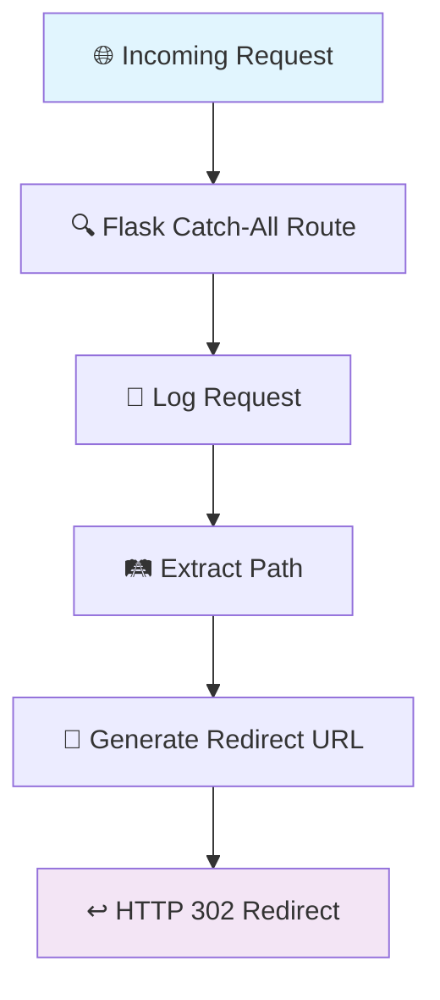

# 🚀 PyRedirect

<div align="center">


**A powerful, lightweight Flask application for intelligent URL redirection** 🔄

[](https://python.org)
[](https://flask.palletsprojects.com)
[](https://docker.com)
[](LICENSE)
[](https://github.com/khaliduzzamantanoy/Pyredirect)
[](https://github.com/khaliduzzamantanoy/Pyredirect)

---

*Seamlessly redirect all incoming requests while preserving path structures with enterprise-grade reliability* ✨

[🚀 Quick Start](#-quick-start) • [📖 Documentation](#-how-it-works) • [🐳 Docker](#-docker-deployment) • [🛠️ Configuration](#-configuration) • [🤝 Contributing](#-contributing)

</div>

---

## ✨ Features

<table>
<tr>
<td>

### 🎯 **Universal Redirect**
Redirect all incoming requests to any external URL with zero configuration hassle

</td>
<td>

### 🛤️ **Path Preservation** 
Maintains original URL structure - no broken links, no lost paths

</td>
</tr>
<tr>
<td>

### 📊 **Smart Logging**
Built-in request logging with timestamps for monitoring and analytics

</td>
<td>

### 🐳 **Docker Ready**
Production-ready containerization with security best practices

</td>
</tr>
<tr>
<td>

### ⚡ **Production Grade**
Gunicorn WSGI server configuration for high-performance deployment

</td>
<td>

### 🔒 **Security First**
Non-root user execution and secure container practices

</td>
</tr>
</table>

---

## 🚀 Quick Start

### 💻 Local Development

```bash
# 📥 Clone the repository
git clone https://github.com/khaliduzzamantanoy/Pyredirect.git
cd Pyredirect

# 📦 Install dependencies
pip install -r requirements.txt

# ⚙️ Configure your redirect URL (edit app.py)
# Replace 'https://your-redirect-url/' with your target

# 🎯 Run the application
python app.py
```

🌐 **Access your app at:** `http://localhost:5000`

### 🐳 Docker Deployment

```bash
# 🔨 Build the Docker image
docker build -t pyredirect .

# 🚀 Run the container
docker run -p 5002:5002 pyredirect
```

🌐 **Access your app at:** `http://localhost:5002`

---

## ⚙️ Configuration

### 🎯 Setting Up Your Redirect URL

<details>
<summary>📝 <strong>Click to expand configuration details</strong></summary>

Edit the `catch_all` function in `app.py`:

```python
@app.route('/', defaults={'path': ''})
@app.route('/<path:path>')
def catch_all(path):
    # 🔄 Replace with your target URL
    return redirect(f'https://your-awesome-site.com/{path}', code=302)
```

</details>

### 📊 Logging Configuration

| Feature | Status | Description |
|---------|--------|-------------|
| 📝 Request Logging | ✅ Enabled | Logs all incoming requests with timestamps |
| 🔇 Disable Logging | ⚙️ Optional | Comment out `@app.before_request` decorator |
| 📈 Custom Logging | 🛠️ Extensible | Add your own logging logic |

### 🔌 Port Configuration

| Environment | Port | Description |
|-------------|------|-------------|
| 🏠 Development | `5000` | Default Flask development server |
| 🐳 Docker | `5002` | Container exposed port |
| 🏭 Production | `5002` | Gunicorn WSGI server |

---

## 📖 How It Works

<div align="center">



</div>

### 🎯 Example Redirections

| Original URL | Redirects To | Status |
|-------------|--------------|--------|
| `yourapp.com/` | `example.com/` | ✅ |
| `yourapp.com/about` | `example.com/about` | ✅ |
| `yourapp.com/api/users/123` | `example.com/api/users/123` | ✅ |
| `yourapp.com/blog/post?id=5` | `example.com/blog/post?id=5` | ✅ |

---

## 📁 Project Structure

```
🗂️ Pyredirect/
├── 🐍 app.py              # Main Flask application
├── 🌐 wsgi.py             # WSGI entry point  
├── 🐳 Dockerfile          # Docker configuration
├── 📦 requirements.txt    # Python dependencies
└── 📖 README.md          # You are here!
```

---

## 🛠️ Dependencies

<div align="center">

| Package | Version | Purpose |
|---------|---------|---------|
|  | `2.x` | Web framework for HTTP handling |
|  | `21.x` | Production WSGI server |

</div>

---

## 🏭 Production Deployment

### 🚀 Manual Deployment

```bash
# 📦 Install production server
pip install gunicorn

# 🏭 Run in production mode
gunicorn --bind 0.0.0.0:5002 app:app
```

### 🔧 Advanced Configuration

<details>
<summary>🛠️ <strong>Advanced Gunicorn Settings</strong></summary>

```bash
# 🚀 High-performance configuration
gunicorn --bind 0.0.0.0:5002 \
         --workers 4 \
         --timeout 30 \
         --keep-alive 2 \
         --max-requests 1000 \
         app:app
```

</details>

---

## 🛡️ Security Features

<div align="center">

| Security Feature | Status | Description |
|------------------|--------|-------------|
| 👤 Non-root User | ✅ | Container runs as unprivileged user |
| 🔒 Minimal Base Image | ✅ | Python slim image reduces attack surface |
| 🚫 No Root Privileges | ✅ | Application runs with limited permissions |
| 📊 Request Monitoring | ✅ | Built-in logging for security analysis |

</div>

---

## 🎯 Use Cases

<div align="center">

### 🌟 **Perfect For:**

</div>

| Use Case | Description | Benefits |
|----------|-------------|----------|
| 🏠➡️🏢 **Domain Migration** | Redirect from old to new domain | SEO preservation, seamless transition |
| 🚧 **Maintenance Mode** | Redirect during site maintenance | User experience continuity |
| ⚖️ **Load Balancing** | Simple traffic distribution | High availability, performance |
| 🔗 **URL Shortening** | Base for shortening services | Scalable, customizable |
| 🧪 **A/B Testing** | Traffic splitting for testing | Data-driven decisions |

---

## 🎨 Customization Examples

### 🌈 Custom Redirect Logic

<details>
<summary>💡 <strong>Advanced Redirect Patterns</strong></summary>

```python
@app.route('/<path:path>')
def smart_redirect(path):
    # 🎯 Conditional redirects based on path
    if path.startswith('api/'):
        return redirect(f'https://api.example.com/{path[4:]}', code=302)
    elif path.startswith('blog/'):
        return redirect(f'https://blog.example.com/{path[5:]}', code=302)
    else:
        return redirect(f'https://main.example.com/{path}', code=302)
```

</details>

### 📊 Enhanced Logging

<details>
<summary>📈 <strong>Advanced Logging Setup</strong></summary>

```python
import logging
from datetime import datetime

# 📝 Setup enhanced logging
logging.basicConfig(level=logging.INFO)
logger = logging.getLogger(__name__)

@app.before_request
def enhanced_logging():
    logger.info({
        'timestamp': datetime.now().isoformat(),
        'method': request.method,
        'url': request.url,
        'user_agent': request.user_agent.string,
        'remote_addr': request.remote_addr
    })
```

</details>

---

## 🤝 Contributing

<div align="center">

**We love contributions!** 🎉

[](https://github.com/khaliduzzamantanoy/Pyredirect/graphs/contributors)

</div>

### 🔄 How to Contribute

```bash
# 🍴 Fork the repository
# 📥 Clone your fork
git clone https://github.com/YOUR_USERNAME/Pyredirect.git

# 🌿 Create a feature branch
git checkout -b feature/amazing-feature

# ✨ Make your changes
# 💾 Commit your changes
git commit -m '✨ Add amazing feature'

# 🚀 Push to your branch
git push origin feature/amazing-feature

# 🎉 Submit a pull request
```

### 📋 Contribution Guidelines

- 🐛 **Bug Reports**: Use issue templates
- ✨ **New Features**: Discuss in issues first
- 📝 **Code Style**: Follow PEP 8
- 🧪 **Testing**: Add tests for new features
- 📖 **Documentation**: Update docs for changes

---

## 📊 Stats & Analytics

<div align="center">


</div>

---

## 📄 License

<div align="center">

This project is licensed under the **MIT License** 📜

[](https://opensource.org/licenses/MIT)

*Feel free to use, modify, and distribute this project* ✨

</div>

---

## 🆘 Support & Community

<div align="center">

| Resource | Link | Description |
|----------|------|-------------|
| 🐛 **Issues** | [GitHub Issues](https://github.com/khaliduzzamantanoy/Pyredirect/issues) | Bug reports & feature requests |
| 💬 **Discussions** | [GitHub Discussions](https://github.com/khaliduzzamantanoy/Pyredirect/discussions) | Community support & ideas |
| 📧 **Contact** | [Create Issue](https://github.com/khaliduzzamantanoy/Pyredirect/issues/new) | Direct support |

**⭐ Star this repo if you find it useful!**

[](https://github.com/khaliduzzamantanoy/Pyredirect/stargazers)

</div>

---

<div align="center">

**Made with ❤️ by [Khaliduzzaman Tanoy](https://github.com/khaliduzzamantanoy)**

*PyRedirect - Simplifying URL redirection, one request at a time* 🚀

---

⚠️ **Important**: Remember to replace `https://your-redirect-url/` in your code with your actual target URL before deployment!

</div>
